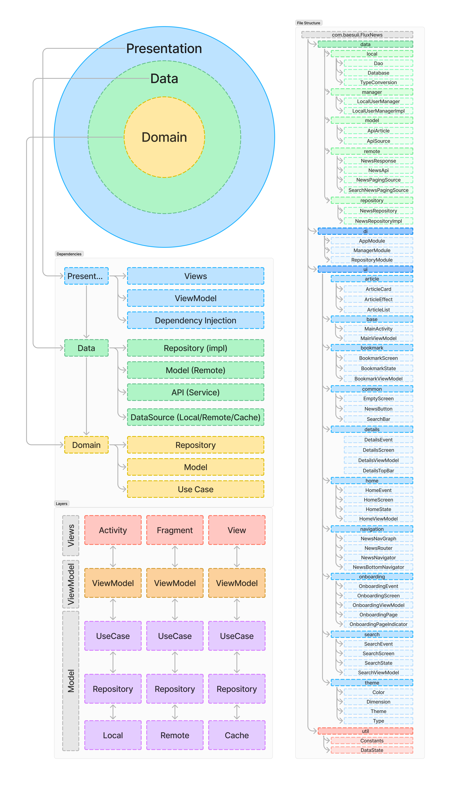

# FluxNews

This app is designed to provide a seamless and user-friendly news reading experience. It features a modern UI built with Jetpack Compose, and it uses MVVM + MVI architecture to ensure separation of concerns and testability. Paging3 is used to efficiently handle large datasets of news articles, and Retrofit is used to fetch news articles from a remote API. Room is used to store news articles locally, and DataStore is used to store user preferences. Dagger Hilt is used to provide dependency injection, making the code more modular and maintainable.

<!--  -->

# Clean Architecture

The core principles of the clean approach can be summarized as followed:

#### Layered Separation:
The application code is organized into distinct layers, each representing a specific concern within the codebase.

#### Strict Dependency Rule:
Each layer is only allowed to interact with layers that are positioned below it in the hierarchy.

#### Generic Lower Layers:
As you move towards the lower layers of the architecture, the code becomes more generic, focusing on defining policies and rules, whereas the upper layers handle specific implementations like database management, user interfaces, and local user managers.

## Technologies used
|                                                                                                                                                                                                                    |                                                                                      |
| :----------------------------------------------------------------------------------------------------------------------------------------------------------------------------------------------------------------: | :----------------------------------------------------------------------------------- |
|                                                | Figma - Designing software Web, Android, iOS and other prototypes                    |
|                                          | Kotlin - Official language for Android development, known for its concise syntax     | 
|                                      | Jetpack Compose - A modern toolkit for building native Android UIs                   |
|                                                                                                                                                                                                                    |                                                                                      |
|  | **Architecture Components**                                                          | 
| UI Layer                                                                                                                                                                                                           | [Paging3](https://kotlinlang.org/) - Efficiently loads data in chunks.  [LiveData](https://developer.android.com/topic/libraries/architecture/livedata) - Observable data holders for UI updates  [ViewModel](https://developer.android.com/topic/libraries/architecture/viewmodel) - Retains UI data across configuration changes  [Navigation Components](https://developer.android.com/guide/navigation/navigation-getting-started) - Simplifies app navigation  [Room](https://developer.android.google.cn/jetpack/androidx/releases/room) -  Abstraction layer over SQLite for easier database access |
| Data Layer                                                                                                                                                                                                         | [DataStore](https://developer.android.com/topic/libraries/architecture/datastore) - Async key-value and typed data storage with Kotlin coroutines |
|                                                                                                                                                                                                                    |                                                                                      |
|                                 | **Dependency Injection**                                                             | 
|                                                                                                                                                                                                                    | [Dagger](https://dagger.dev/) - A compile-time DI framework  [Hilt](https://dagger.dev/hilt) - Simplifies using Dagger in Android    |  
|                                                                                                                                                                                                                    |                                                                                      |     
|                                                                                                                          | Other Dependencies                                                                   |
|                                                                                                                                                                                                                    | [Retrofit](https://square.github.io/retrofit/) - Android's and Java's type-safe HTTP client   |
