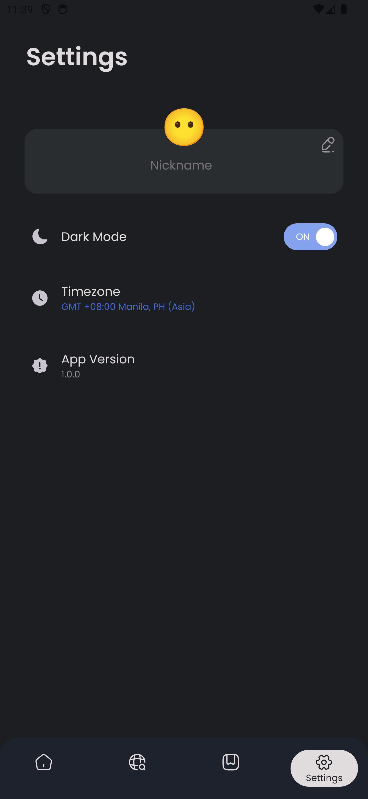

# Overview

FluxNews is an Android app using Kotlin and Jetpack Compose and provides real-time news updates. It's made for limited amount of time but it has the following features:

- **Onboarding Experience**: Seamless and informative experience for new users
- **Home with Breaking News & Worldwide News**: Able to view the latest breaking news from all over the world
- **Explore News by Categories**: Easily browse news by categories such as health, technology, business and more
- **Search for Articles**: Quickly find articles related to your interests
- **Bookmark Articles**: Tap once and save the articles to read later
- **Real-Time Weather**: Get weather updates in real time based on your specified timezone
- **Article Details**: Read brief content of an article, as well as share and read more by directing to the article link.
- **Personalized Settings**: Give yourself a nickname and toggle dark mode.

# **Preview**
  
   

# **Screenshots**
   
   

# Architecture
- Presentation: Responsible for the UI and input management
- Domain: Contains the business logic, including the use cases and repository interfaces
- Data: Responsible for database operations, network requests and caching.

# **Technologies Used**
|                                                                                                                    |                                                                                            |                                                                                     |
|--------------------------------------------------------------------------------------------------------------------|------------------------------------------------------------------------------------------- |-------------------------------------------------------------------------------------|
|  | [**Kotlin**](https://kotlinlang.org/)                                           | Official language for Android development, known for its concise syntax             |
|                  | [**Jetpack Compose**](https://developer.android.com/jetpack/compose)                       | A modern toolkit for building native Android UIs                                    |
|                          | [**Figma**](https://www.figma.com/)                                                        | A collaborative design tool for creating UI/UX designs                              |
|                                      | [**Paging Library**](https://developer.android.com/topic/libraries/architecture/paging)    | Efficiently loads data in chunks (paging)                                           |
|                                      | [**LiveData**](https://developer.android.com/topic/libraries/architecture/livedata)        | An observable data holder for UI updates                                            |
|                                      | [**ViewModel**](https://developer.android.com/topic/libraries/architecture/viewmodel)      | Retains UI data across configuration changes                                        |
|                                      | [**Navigation Components**](https://developer.android.com/guide/navigation/navigation-getting-started) | Simplifies app navigation                                               |
|                                    | [**Retrofit**](https://square.github.io/retrofit/)                                         | A type-safe HTTP client for making API requests                                     |
|                                      | [**Room**](https://developer.android.com/training/data-storage/room)                       | A persistence library for local database management                                 |
|                                      | [**DataStore**](https://developer.android.com/topic/libraries/architecture/datastore)      | Async key-value and typed data storage with Kotlin coroutines                       |
|                                  | [**Coil**](https://coil-kt.github.io/coil/)                                                | An image loading library for Android                                                |
|                                                | [**NewsAPI**](https://newsapi.org/)                                                        | A third-party API for fetching news articles                                        |
|                                   | [**OpenWeatherMap**](https://openweathermap.org/)                                          | A third-party API for fetching real-time weather data                               |
|                        | [**Dagger**](https://dagger.dev/)                                                          | A compile-time dependency injection framework for Android                           |
|                        | [**Hilt**](https://dagger.dev/hilt/)                                                       | A dependency injection library that simplifies injecting dependencies in Android apps |
|                               | [**OkHttp**](https://square.github.io/okhttp/)                                             | A networking library for HTTP requests                                              |
|                                         | [**JUnit**](https://junit.org/junit5/)                                                     | A testing framework for writing unit tests                                          |
|                                  | [**MockK**](https://mockk.io/)                                                             | A mocking framework for unit testing Kotlin code                                    |
|                                   | [**Turbine**](https://github.com/cashapp/turbine)                                          | A testing library for Kotlin Flows                                                  |

